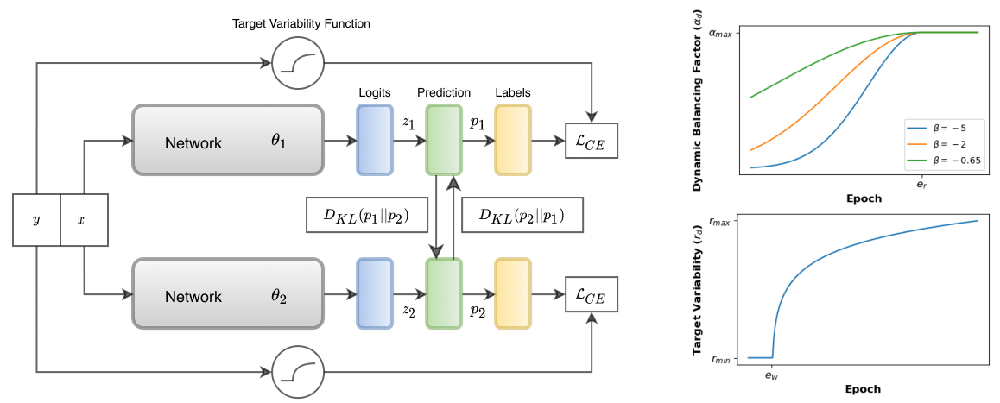

# Noisy Concurrent Training (ACT)

This is the official code for the WACV'21 Paper [Noisy Concurrent Training for Efficient Learning under Label Noise"](https://arxiv.org/abs/2009.08325) by 
[Fahad Sarfraz](https://scholar.google.com/citations?user=Zhx_sM4AAAAJ&hl=en), [Elahe Arani](https://www.researchgate.net/profile/Elahe-Arani) and [Bahram Zonooz](https://scholar.google.com/citations?hl=en&user=FZmIlY8AAAAJ)

##Abstract
Deep neural networks (DNNs) fail to learn effectively under label noise and 
have been shown to memorize random labels which affect their generalization 
performance. We consider learning in isolation, using one-hot encoded labels 
as the sole source of supervision, and a lack of regularization to discourage 
memorization as the major shortcomings of the standard training procedure. 
Thus, we propose Noisy Concurrent Training (NCT) which leverages collaborative 
learning to use the consensus between two models as an additional source of 
supervision. Furthermore, inspired by trial-to-trial variability in the brain, 
we propose a counter-intuitive regularization technique, target variability, 
which entails randomly changing the labels of a percentage of training samples 
in each batch as a deterrent to memorization and over-generalization in DNNs. 
Target variability is applied independently to each model to keep them diverged 
and avoid the confirmation bias. As DNNs tend to prioritize learning simple patterns 
first before memorizing the noisy labels, we employ a dynamic learning scheme 
whereby as the training progresses, the two models increasingly rely more on their 
consensus. NCT also progressively increases the target variability to avoid 
memorization in later stages. We demonstrate the effectiveness of our approach 
on both synthetic and real-world noisy benchmark datasets.

For details, please see the
[Paper](https://arxiv.org/abs/2009.08325)
and [Presentation Video](https://www.youtube.com/watch?v=_N7J0G9mjAw&ab_channel=NeurAI) 

### Cite Our Work
If you find the code useful in your research, please consider citing our paper:

<pre>
@inproceedings{sarfraz2021noisy,
  title={Noisy Concurrent Training for Efficient Learning under Label Noise},
  author={Sarfraz, Fahad and Arani, Elahe and Zonooz, Bahram},
  booktitle={Proceedings of the IEEE/CVF Winter Conference on Applications of Computer Vision},
  pages={3159--3168},
  year={2021}
}
</pre>

### License
This project is licensed under the terms of the MIT license.
